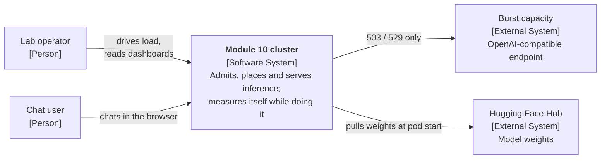
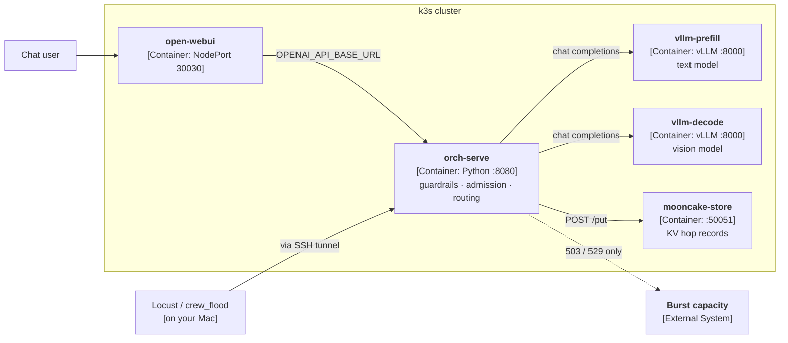
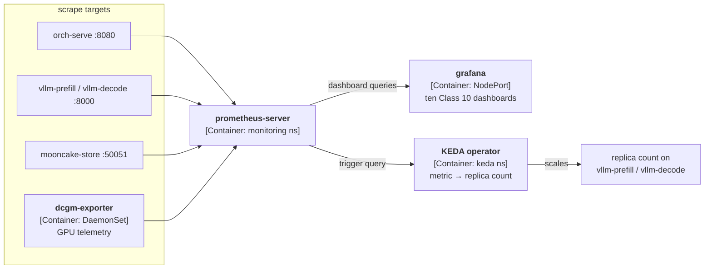
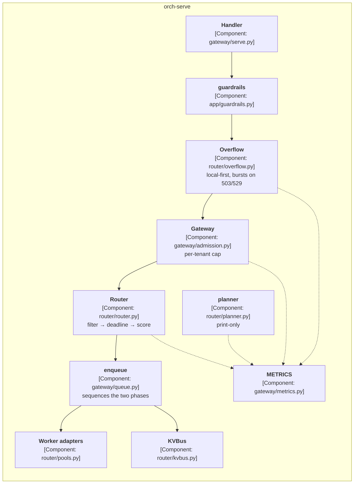
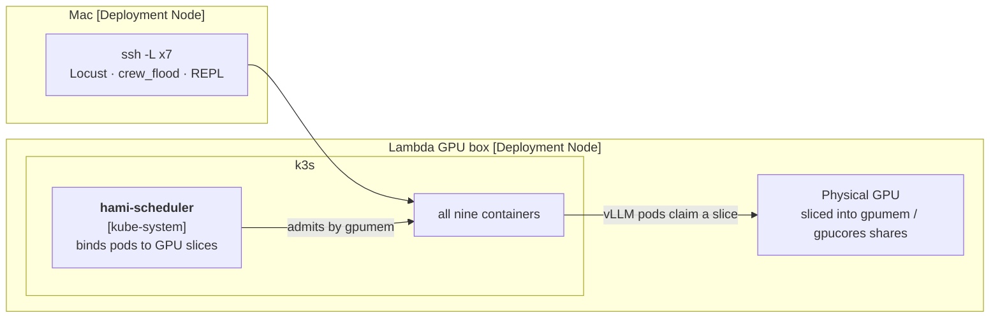

# Architecture — Module 10, cluster profiling

Overview only. Each component has its own deep dive; this page is the map.

Described with the [C4 model](https://c4model.com). Module 10 is the **complete
stack**: the disaggregated cluster, the observability layer, and the engine-tuning
tools, in one module.

| Layer | What it covers |
|---|---|
| Serving | Guardrails, admission, placement, prefill/decode split, KV hop, burst capacity |
| Observability | Per-replica metrics, stage histograms, ten Grafana dashboards, DCGM, load harnesses |
| Engine tuning | Attention HBM math, KV eviction policies, CUDA-graph warmup, pluggable KV transports |

Everything below the cluster steps runs on a laptop with no GPU.

## The docs

| Page | Covers |
|---|---|
| **[DATAFLOW.md](DATAFLOW.md)** | One request through the code, file by file — start here |
| [gateway.md](gateway.md) | Entry, guardrails, admission |
| [router.md](router.md) | Placement, scoring, shedding, the `router/` file map |
| [kvbus.md](kvbus.md) | Prefix bookkeeping, the KV hop, eviction |
| [observability.md](observability.md) | Histograms, `profile`, dashboard generation |
| [kernels.md](kernels.md) | Attention math, KV eviction, warmup, KV transports |
| [infrastructure.md](infrastructure.md) | SSH access, pod startup, HAMi, KEDA |
| [COMMANDS.md](COMMANDS.md) | Debugging reference |

---

## Level 1 — System context

**Overflow lives at this level.** Burst capacity is the only external system the
request path can reach, and only on a capacity 503/529 — never on a 429 or a
`slice_oom`. That boundary is the system's most important architectural fact.

---

## Level 2 — Containers

Nine containers. C4 wants one container diagram; at nine boxes with a scrape
loop in the middle it becomes unreadable, so it is split by concern here — the
inventory table below is the complete list.

### 2a — Request path

### 2b — Control and observability

`KEDA → replica count` feeds back into the pods in 2a — that loop is drawn
open here rather than closed so the layout stays readable. See
[infrastructure.md](infrastructure.md#the-autoscale-loop) for the timing.

### Container inventory

| Container | Type | Where | Covered in |
|---|---|---|---|
| `open-webui` | Browser chat, NodePort 30030 | `default` | [infrastructure.md](infrastructure.md) |
| `orch-serve` | Gateway + router, :8080 | `default` | [gateway.md](gateway.md), [router.md](router.md) |
| `vllm-prefill` | vLLM engine, text model | `default` | [DATAFLOW.md](DATAFLOW.md#8-engine-internals) |
| `vllm-decode` | vLLM engine, vision model | `default` | [DATAFLOW.md](DATAFLOW.md#8-engine-internals) |
| `mooncake-store` | KV hop record server | `default` | [kvbus.md](kvbus.md) |
| `prometheus-server` | Scrapes all of the above | `monitoring` | [observability.md](observability.md) |
| `grafana` | Ten dashboards | `monitoring` | [observability.md](observability.md) |
| `dcgm-exporter` | GPU telemetry DaemonSet | `monitoring` | [observability.md](observability.md) |
| `keda-operator` | Autoscaling controller | `keda` | [infrastructure.md](infrastructure.md) |

`hami-scheduler` (`kube-system`) is deliberately absent — it schedules pods onto
GPU slices but is not a container in the data path. It appears in the
[deployment view](#deployment-view) instead, which is where C4 puts
infrastructure.

---

## Level 3 — Components inside orch-serve

| Component | Deep dive |
|---|---|
| `Handler`, `guardrails`, `Gateway` | [gateway.md](gateway.md) |
| `Router`, `Overflow`, `Worker adapters` | [router.md](router.md) |
| `KVBus`, `enqueue` | [kvbus.md](kvbus.md), [DATAFLOW.md](DATAFLOW.md#4-the-queue--there-isnt-one) |
| `METRICS`, `planner` | [observability.md](observability.md) |

---

## Deployment view

Where HAMi sits: it is infrastructure, not a container in the request path.

HAMi's CUDA shim makes each vLLM container see **its slice, not the card** —
which is why `--gpu-memory-utilization` is a fraction of the slice. Full
explanation in [DATAFLOW.md](DATAFLOW.md#6-hami--what-it-buys-you).

---

## Where things are *not*

Worth stating up front, because the file layout implies otherwise:

- **No queue.** `gateway/queue.py` sequences two phases; it holds nothing. See
  [DATAFLOW.md](DATAFLOW.md#4-the-queue--there-isnt-one).
- **No parallelism.** Every engine is world size 1. See
  [DATAFLOW.md](DATAFLOW.md#9-parallelism--there-isnt-any).
- **No laptop path.** Module 9's `fakeworker` does not exist in 10.
- **`planner.py` actuates nothing** — KEDA does the scaling.
