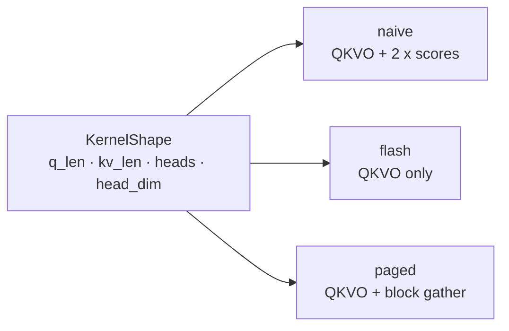
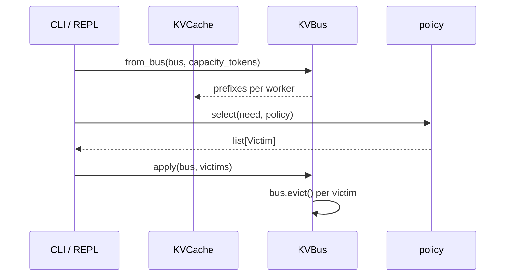
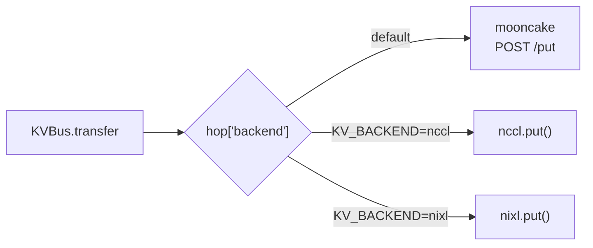
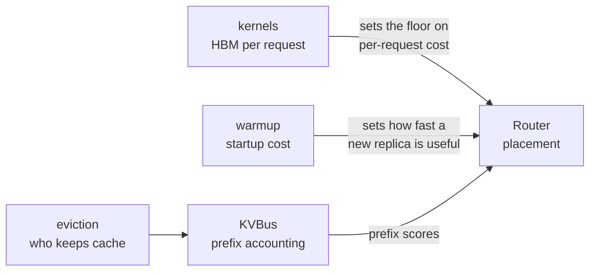

# Engine tuning — kernels, eviction, warmup, transports

The layer below the cluster. Four things module 10 adds that answer "where do the
bytes and the milliseconds actually go", all runnable on a laptop with no GPU.

Part of the [module 10 docs](README.md). Overview: [ARCHITECTURE.md](ARCHITECTURE.md) · Request path: [DATAFLOW.md](DATAFLOW.md)

| Topic | Module | REPL command |
|---|---|---|
| Attention HBM traffic | `kernels/engineering.py` | `kernel [q] [kv]` |
| KV eviction policy | `router/kv_eviction.py` | `pressure [need] [policy]` |
| Warmup budget | `router/warmup.py` | `warmup [budget]` |
| KV transport | `router/nccl.py`, `nixl.py` | — (`KV_BACKEND`) |

These are **arithmetic models, not benchmarks.** They compute what a kernel
*would* move and what a warmup *would* cost, so you can reason about the
tradeoff without renting a GPU. No CUDA is involved.

---

## Attention kernels — counting HBM traffic

```
python -m kernels.engineering --q 128 --kv 2048
```

```
shape q=128 kv=2048 d=128 h=32 paged=1
backend paged_prefill  tile_q=64 tile_k=128 sram=114688
hbm naive=69206016 flash=35651584 chosen=36700160  naive/flash=1.94
```

The model is four terms (`kernels/engineering.py:22`):

| Term | Bytes |
|---|---|
| Q, O | `batch × heads × q_len × head_dim × 2` each |
| K, V | `batch × heads × kv_len × head_dim × 2` each |
| **scores** | `batch × heads × q_len × kv_len × 2` |
| paged gather | `ceil(kv_len / block_size) × heads × head_dim × 2` |



**The whole point is the `2 × scores` term.** Naive attention writes the
score matrix to HBM and reads it back; FlashAttention keeps it in SRAM and never
materialises it. Since scores scale with `q_len × kv_len` while QKVO scales with
`q_len + kv_len`, the saving grows with sequence length.

That is why the ratio moves the way it does:

| Case | `q_len` | Ratio | Why |
|---|---|---|---|
| Long prefill | 128+ | ~2x and rising | The score matrix dominates |
| Decode | 1 | ~1x | One query row — there is barely a matrix to avoid |

Try `--q 1` to see it collapse. **FlashAttention is a prefill optimisation**; it
does almost nothing for decode, which is memory-bound on KV instead.

### Why tiling has a ceiling

`sram_bytes()` (`:42`) sums the Q, K, V tiles plus an fp32 accumulator, and
`tile_fits()` checks it against `H100_SRAM_BYTES = 227_328`. `pick_tile()` walks
`tile_k` down from 128 until it fits.

That constant is the real constraint on the whole technique: the tile must live
in on-chip SRAM, or you are back to HBM round-trips. Fix `head_dim` and the
hardware fixes your tile size.

---

## KV eviction — who gets dropped

```
python -m router.kv_eviction --policy prefix_protect --need 1024
```

```
kvcache used=3072 free=1024 cap=4096 policy=prefix_protect victims=1
  drop text-0 old-unique tokens=1024 reason=prefix_protect
```

Builds a `KVCache` from the prefix bus, then picks victims until `need` tokens
are free. Four policies (`router/kv_eviction.py:81`):

| Policy | Evicts | Good when |
|---|---|---|
| `lru` | Least recently used | Uniform traffic |
| `lfu` | Least frequently used | Stable hot set |
| `priority` | Lowest-priority tenant first | Tiered SLAs |
| `prefix_protect` | Unique prefixes before shared ones | **Many users, one system prompt** |



`prefix_protect` is the one worth understanding. A shared prefix is amortised
across every request that reuses it, so evicting it costs *all* of them a
recompute; a unique prefix costs one. Same bytes freed, very different damage.

This connects directly to [kvbus.md](kvbus.md) — `apply()` calls `bus.evict()`,
so eviction here moves the same accounting the router scores on.

---

## Warmup — paying the cold start once

```
python -m router.warmup --budget 1500 --prefix 256
```

```
warmup 570ms  first_ttft 1790ms  graphs=1 cache=1 parallel=1 prefix=256
naive 18400ms  first_ttft 40ms  speedup 32.28x
```

A cost model over five constants (`router/warmup.py:8`):

| Constant | ms | Represents |
|---|---|---|
| `ALLOCATE_MS` | 400 | KV pool allocation |
| `FORWARD_MS` | 800 | One dummy forward pass |
| `GRAPH_MS` | 250 | **Per CUDA-graph bucket captured** |
| `PREFIX_MS_PER_TOKEN` | 0.05 | Pre-seeding a prefix |
| `CACHE_HIT` | 0.15 | Compile-cache multiplier |

Read the output carefully — **the two numbers move in opposite directions**:

- `warmup` is what you pay at startup
- `first_ttft` is what your first user pays

Capturing every bucket gives the best `first_ttft` (40 ms) at a brutal warmup
(18 400 ms). Capturing one bucket within a 1500 ms budget costs the first user
1790 ms but is ready 32x sooner. **The "speedup" is startup time, not inference
speed** — an easy misread.

This is the arithmetic behind what you saw on the cluster: pods sitting at
`READY 1/1` for minutes while `torch.compile` captured 67 bucket sizes. See
[infrastructure.md](infrastructure.md#pod-startup--why-ready-11-lies).

---

## KV transports — Mooncake, NCCL, NIXL

Module 10 makes the hop backend pluggable. `KVBus.transfer` no longer calls
Mooncake directly; it dispatches on the `backend` field of the hop
(`router/kvbus.py:70`):



**`nccl.py` and `nixl.py` are four lines each and do nothing:**

```python
def put(hop: dict) -> None:
    return
```

They are deliberate no-op stubs. The lesson is the *seam* — that transport is a
swappable concern behind one call — not the implementation. Setting
`KV_BACKEND=nccl` makes hops vanish from Mooncake's `/hops` while the request
path still works, which is a useful thing to observe.

Consequence for debugging: **zero hops in the Mooncake dashboard does not prove
the hop did not happen.** Check `KV_BACKEND` before concluding anything.

---

## How these connect



Each answers a different question the cluster raises but cannot answer:
attention math says what one request *must* cost, warmup says what a KEDA
scale-up actually buys you and when, and eviction says who loses their cache
when the KV wall is hit.
