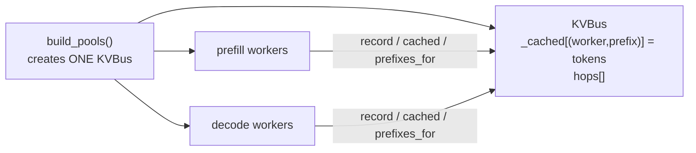
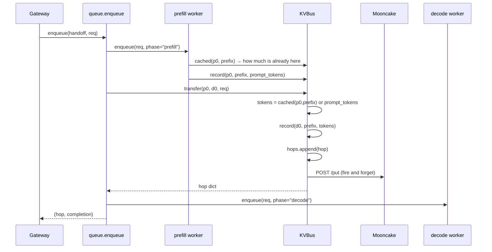
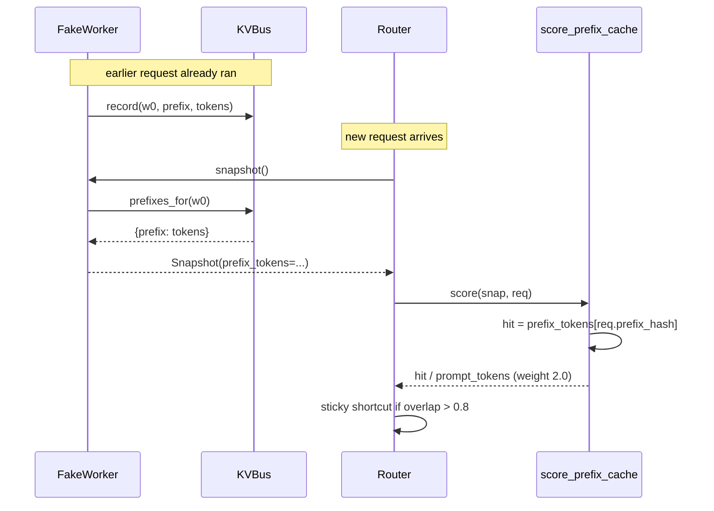
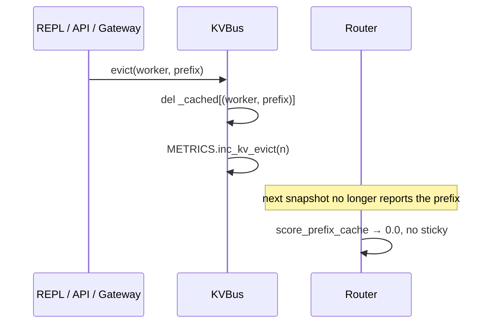
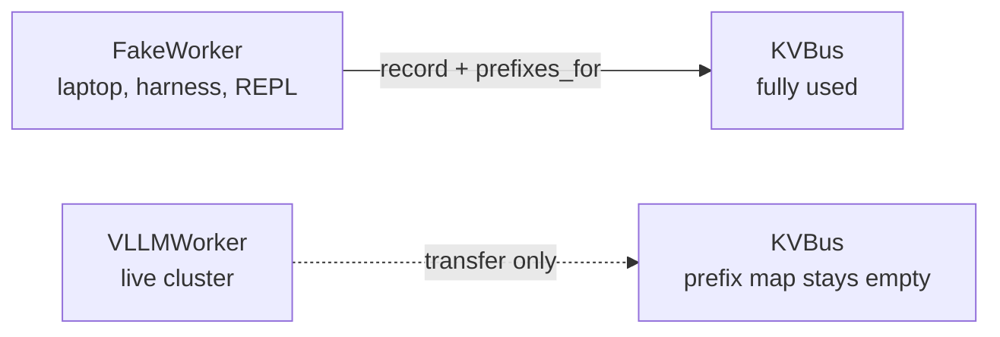

# KVBus — the KV cache lifecycle

How prefix bookkeeping works, why it steers placement indirectly, and why it is inert against real vLLM.

Part of the [module 10 docs](README.md). Overview: [ARCHITECTURE.md](ARCHITECTURE.md) · Request path: [DATAFLOW.md](DATAFLOW.md)

---

## KVBus — the KV cache lifecycle

`router/kvbus.py` is a **single in-memory dict** shared by every worker in both
pools, keyed by `(worker_id, prefix_hash)` and holding a token count. It is not
the KV cache itself — vLLM owns that. It is the router's *bookkeeping* of which
pod is believed to hold which prefix, plus the hop record it ships to Mooncake.

One instance is created in `build_pools()` and handed to every worker, so all
pods read and write the same map.

## Flow 1 — the two-phase hop

This is `LAB_SPLIT=phase`, the REPL's `hop` command. `enqueue` drives prefill,
asks the bus to transfer, then drives decode.

Two things worth noticing. `transfer` **copies the accounting entry to the
destination** — after the hop, the bus believes `d0` holds that prefix too.
And `_store_put` swallows every network error, so a dead Mooncake silently
produces no hop record while the request still succeeds.

## Flow 2 — how the bus steers placement

This is the loop that makes prefix affinity work, and it is easy to miss because
no component calls the bus directly during scoring — it arrives via `Snapshot`.

So the chain is **`record` → `prefixes_for` → `Snapshot.prefix_tokens` →
`score_prefix_cache` → placement**. The bus never talks to the router; it is
read through the worker's snapshot.

## Flow 3 — eviction, and why it exists

Three different callers can drop entries:

| Caller | Trigger | What it drops |
|---|---|---|
| `gateway/repl.py:440` | REPL `evict` (Step 17) | The last hop's `src` and `dst`, then every worker |
| `gateway/admission.py:59` | `req.evict_after` set | `src` and `dst` of the hop just made |
| `gateway/serve.py:65` | `evict_prefixes()` API | Every worker on every bus |

Without eviction the bus keeps claiming a pod holds a prefix that vLLM has long
since dropped, and the router keeps steering traffic at that **ghost cache** —
scoring a hit that no longer exists. That is exactly what Step 17 demonstrates.

## The catch: this is inert on a real cluster

`VLLMWorker` accepts a `bus` and stores it, but **never calls `record()`**, and
its `snapshot()` hardcodes `prefix_tokens=None` (`router/pools.py:237`).

`score_prefix_cache` returns `None` the moment `prefix_tokens is None`, and
`_score` skips scorers that return `None` — so against real vLLM:

- prefix affinity contributes **nothing** to placement
- the sticky shortcut never fires, and `orch_sticky_total` stays `0`
- prefill is scored on token load and free KV only
- `transfer()` still runs, so `cached(src, …)` returns `0` and the hop falls
  back to `req.prompt_tokens`

So flows 1 and 3 are live on the cluster; **flow 2 only runs under
`FakeWorker`**. If you are watching the Router dashboard wondering why sticky
never moves, that is why — not a bug in your run.

## Method reference

| Method | Called by | Purpose |
|---|---|---|
| `record(w, prefix, n)` | `FakeWorker.enqueue`, `transfer` | Claim that `w` holds `n` tokens of `prefix` |
| `cached(w, prefix)` | `FakeWorker.enqueue`, `transfer` | How much is already there — drives uncached work |
| `prefixes_for(w)` | `FakeWorker.snapshot` | Feeds `Snapshot.prefix_tokens` |
| `transfer(src, dst, req)` | `queue.enqueue` | The hop: record, count, POST to Mooncake |
| `evict(w, prefix)` | REPL, admission, serve | Drop one claim, bump `orch_kv_evict_total` |
| `evict_workers(ids, prefix)` | 10 only | Bulk evict across pods |
| `forget_worker(w)` | *nothing* | Dead code — no caller in the repo |
