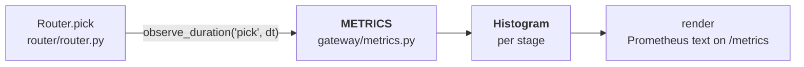
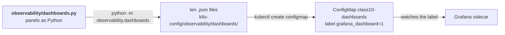
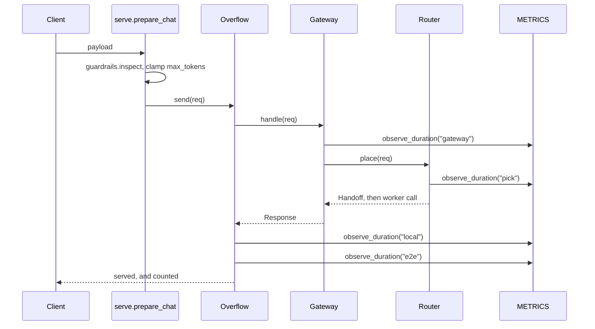

# Observability — metrics, profiling and dashboards

The histograms 10 adds, and how the ten Grafana dashboards are generated.

Part of the [module 10 docs](README.md). Overview: [ARCHITECTURE.md](ARCHITECTURE.md) · Request path: [DATAFLOW.md](DATAFLOW.md)

---

## The observation path

Module 9's metrics were counters and gauges. 10 adds **histograms**, which is
what makes `profile` possible.

| Stage | Measures |
|---|---|
| `gateway` | Admission — the tenant cap check |
| `pick` | Placement — filter, deadline, sticky, score |
| `local` | The worker call itself |
| `overflow` | The burst call, when one happens |
| `e2e` | Everything, end to end |

`METRICS.profile_summary()` prints count, total and mean per stage — the REPL's
`profile` command. `refresh_from_router()` walks both pools and snapshots every
replica into `orch_replica_*` series, which is what turns one gauge per fleet
into one gauge per pod.

---

## The dashboard path

Dashboards are **generated, not hand-drawn**. `dashboards.py` holds a
`METRIC_NAMES` map and builds panels from it, so a renamed metric is a one-line
change rather than ten JSON edits. `day2_observability.sh` regenerates them on
every run.

---

---

## One measured request

Where each stage is actually recorded:

| Stage | Call site |
|---|---|
| `gateway` | `gateway/admission.py` — five sites, one per exit path |
| `pick` | `router/router.py` — four sites, including the sticky shortcut |
| `local`, `e2e` | `router/overflow.py:131` — in `_finish`, so every outcome is timed |
| `overflow` | `router/overflow.py:134` — only when a burst actually happened |

Every stage boundary writes a histogram sample. That is the whole difference
between module 9 and 10: module 9 tells you *what* happened, 10 tells you *where
the time went*.

---
