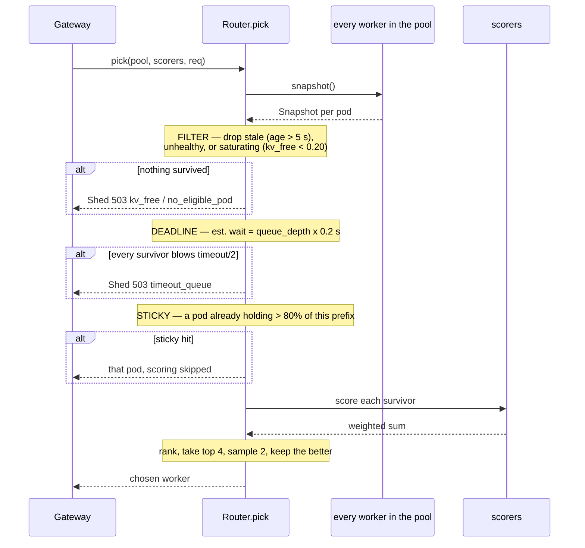
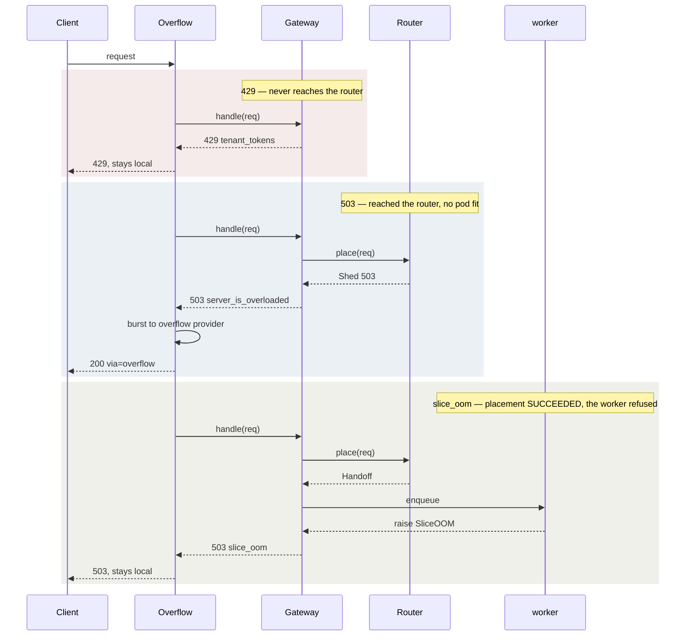

# Router — placement, scoring and shedding

What the seven files in `router/` do, which of them are on the request path, and
how a pod is chosen.

Part of the [module 10 docs](README.md). Overview: [ARCHITECTURE.md](ARCHITECTURE.md) · Request path: [DATAFLOW.md](DATAFLOW.md)

---

## The files

| File | On the request path? | Role |
|---|---|---|
| `router.py` | **yes** | `place()` and `pick()` — the only decision-maker |
| `pools.py` | **yes** | `FakeWorker` / `VLLMWorker` behind one `Worker` protocol |
| `kvbus.py` | **yes** | Prefix bookkeeping and the hop — see [kvbus.md](kvbus.md) |
| `overflow.py` | **yes** | Local-first vs burst |
| `mooncake.py` | no | A **server**, runs in the `mooncake-store` pod |
| `planner.py` | no | Print-only replica math, consumed by nothing |
| `trace.py` | side | Writes `traces/requests.jsonl` |

`mooncake.py` is the one that trips people up: it is `python -m router.mooncake`
inside its own pod. The client side is `_store_put()` in `kvbus.py`.

---

## Placement — what `Router.pick` does, in order

The scoring table below says *what* is weighed. This says *when* — the filter
runs before scoring, and two shortcuts can exit early.

Reading that order matters: a saturating pod is never scored, so a high
prefix-cache hit cannot rescue it. And the sticky shortcut bypasses scoring
entirely — which is why `orch_sticky_total` and `orch_pick_total` diverge.

---

## Placement scoring

Each pool is scored by a different set of signals, weighted, then sampled
power-of-two-choices from the top 4. A pod is excluded *before* scoring if its
snapshot is stale, unhealthy, or saturating.

| Scorer | Weight | Prefill pool | Decode pool |
|---|---|---|---|
| `score_prefix_cache` | 2.0 | yes | — |
| `score_token_load` | 1.0 | yes | — |
| `score_kv_utilisation` | 1.0 | yes | yes |
| `score_active_request` | 1.0 | — | yes |
| `score_queue_depth` | 1.0 | — | — |

`score_queue_depth` is defined and weighted but is in neither pool's scorer
list; queue depth reaches placement only through the deadline filter, which
drops any pod whose estimated wait exceeds half the request timeout.

---

## Failure modes

Which rejection each component produces, and whether it can overflow:

| Reason | Status | Raised by | Overflows? |
|---|---|---|---|
| `tenant_tokens` | 429 | `Gateway._over_cap` | no |
| `timeout_queue` | 503 | `Router.pick` deadline filter | yes |
| `kv_free` | 503 | `Router._filter` saturation | yes |
| `no_eligible_pod` | 503 | `Router._filter` empty | yes |
| `slice_oom` | 503 | worker exceeded its HAMi slice | no |
| upstream 500 | 500 | worker | retried once locally |

Where each rejection is decided, and how far the request got:

The three differ by **how far the request travelled**. A 429 is decided before
placement; a capacity 503 after placement failed; `slice_oom` after placement
*succeeded*. That is why the first and third must not burst — capacity was never
the problem — while the middle one must.

`slice_oom` is the interesting one: the pod is alive, healthy and scheduled — it
simply cannot grow past its `gpumem` share. Bursting would not help, so it is
refused locally.

---
