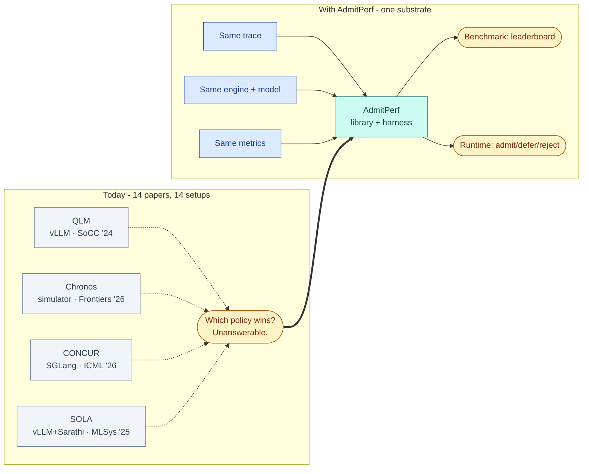

# Motivation

## The question

When an LLM serving fleet is offered more load than it can serve at SLO, something at ingress must decide, per request: **admit, hold, or reject**. Every deployment makes this decision — usually implicitly, via a queue that fills up.

The open question is not *whether* admission control helps. It is **which admission signal wins under which workload** — queue depth, KV pressure, deadline slack, tenant credit, or agent-session state.

Nobody can answer that today. A companion survey of the literature (preprint pending) found, across 14 admission-primary papers: **zero shared baselines** — no two papers agree on baseline system, engine version, workload, or SLO definition — and **one** released implementation. Every paper reports a win against a different opponent on a different field.

## The ask, minimally

Two policies are comparable only if they share four things:

| | |
|---|---|
| One **interface** they both implement | `AdmissionPolicy.decide(req, state) -> Decision` |
| One **input stream** they both see | `TraceLoader → TraceEvent` |
| One **scoreboard** they are both graded on | [`metrics.md`](metrics.md) |
| One **substrate** they both run on | the harness + engine glue |

AdmitPerf is those four things and nothing else. Workloads, policy ports, the leaderboard, and any paper are all downstream of them.

**Corollary that constrains the design**: if the substrate is expensive or nondeterministic, nobody reproduces our numbers either — and we will have reproduced the exact crisis we are documenting. Cheap and deterministic is a requirement, not a budget concession.

## Success and kill criteria

**Succeeds if** a third party can clone this, plug in their own policy, and get a number that is directly comparable to every other policy's number — without owning a GPU cluster or trusting our word for anything.

**Should be killed if** any of:
- the ingress-only constraint excludes the policies that matter most,
- reproducing published policies faithfully proves impossible and every finding must be caveated with *"as implemented in our harness"*,
- an existing harness (AgenticSwarmBench, llm-d, MLPerf multi-turn) adds an admission axis first.

See the [gap matrix](prior-art/gap_matrix.md) for scoop-risk tracking.
