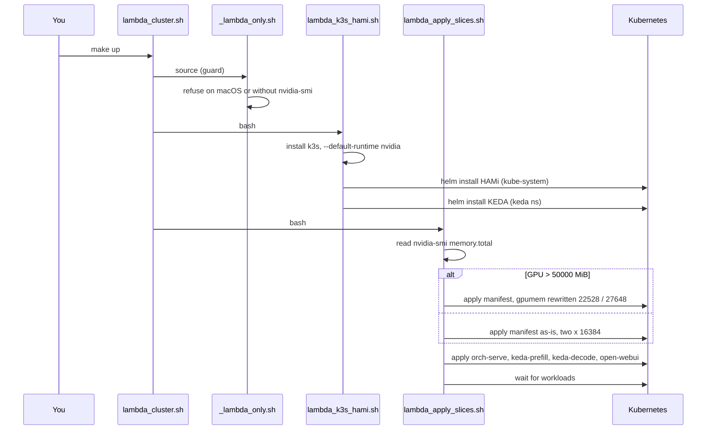
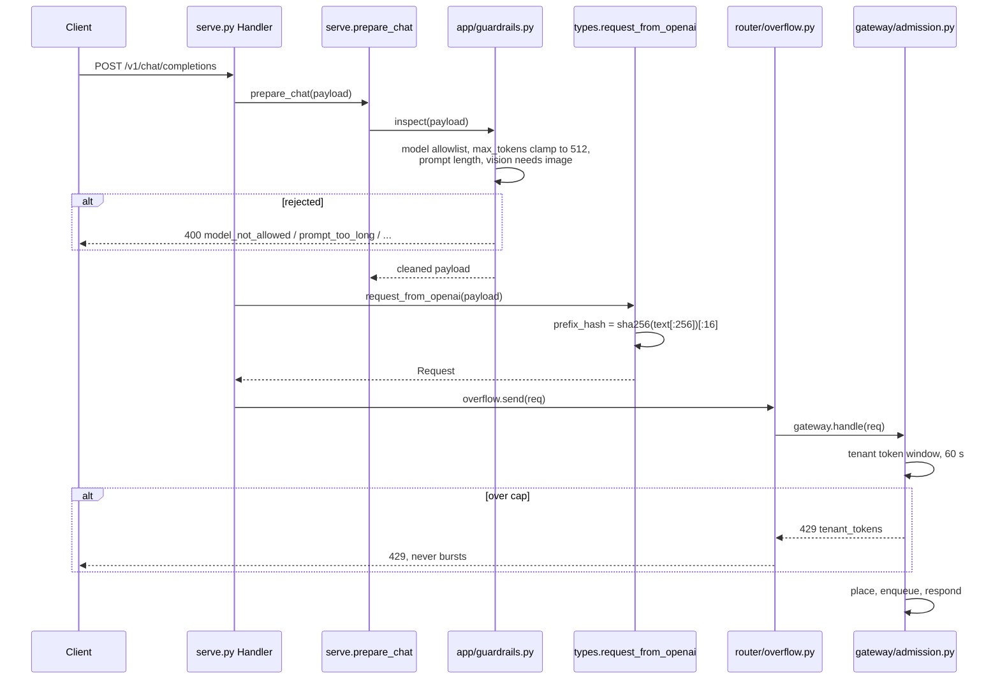
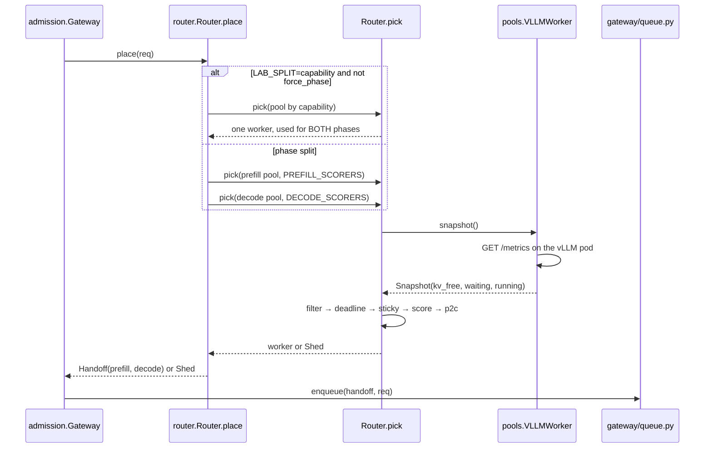
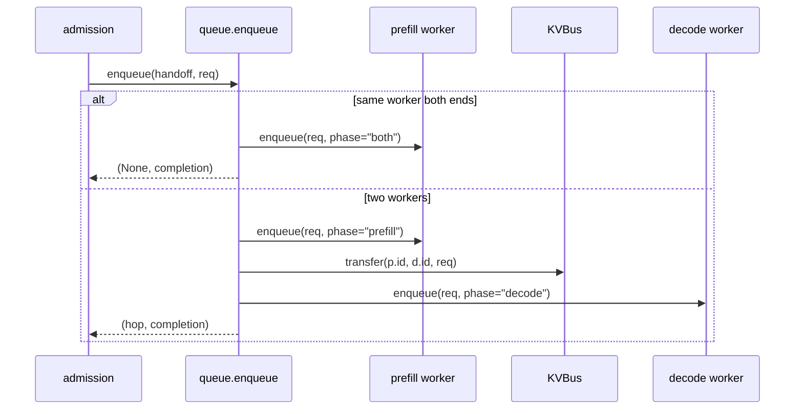
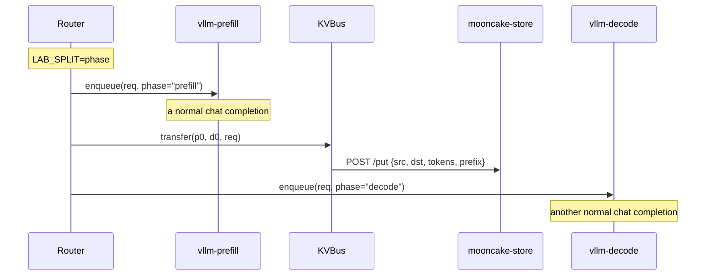
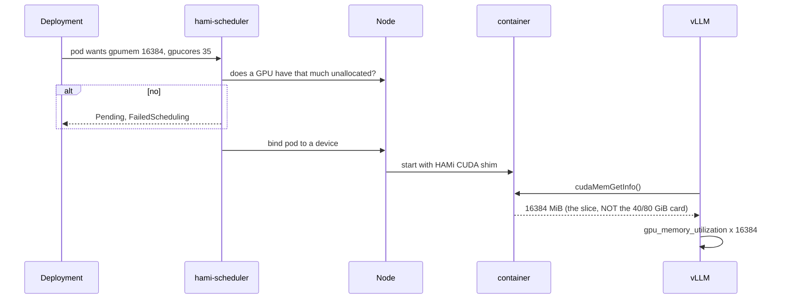
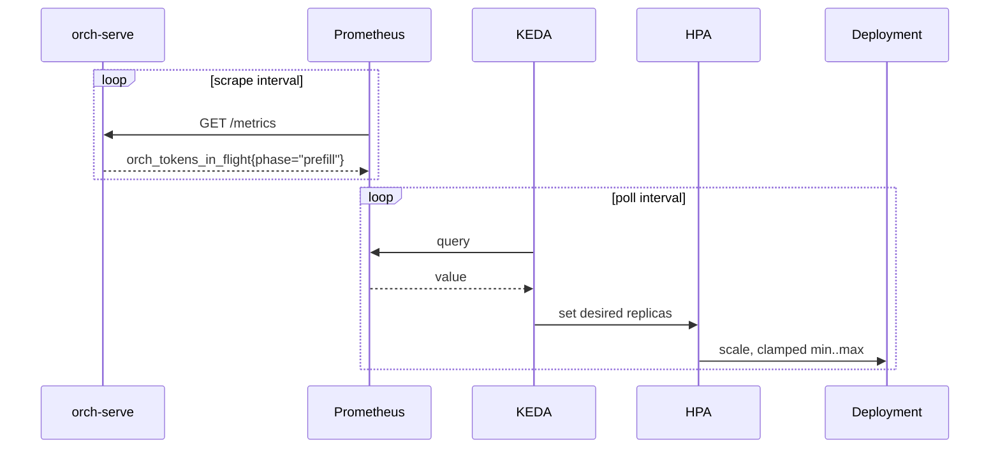
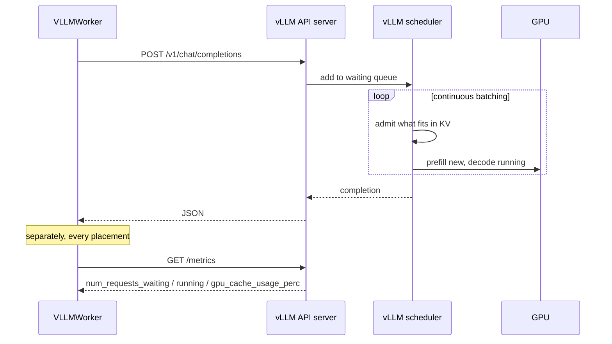
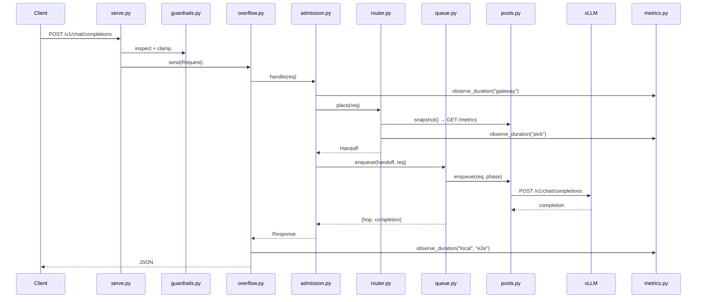

# Data flow — where a request actually goes, file by file

> **The bring-up commands in this file predate the Helm chart.** `infra/render.py`,
> `infra/config/*.yaml` and `infra/setup/lambda_*.sh` no longer exist; a topology is
> now `infra/values/<name>.yaml` and the commands are `make plan` / `make up` /
> `make down` (see [../README.md](../README.md)). Everything about the gateway, router,
> KV transport and dashboards still describes the code in `infra/lib`, which moved
> across unchanged.

[ARCHITECTURE.md](ARCHITECTURE.md) describes the shape of the system. This one
follows a single request through the code, naming the file and line at each
step, and answers the questions the file layout does not.

| Section | Question |
|---|---|
| [1. Provisioning](#1-provisioning--how-the-cluster-comes-up) | What creates what, in what order? |
| [2. Gateway + admission](#2-gateway--admission) | Where does a request arrive and who lets it in? |
| [3. Router](#3-router--what-it-actually-decides) | What are all those router files for? |
| [4. Queue](#4-the-queue--there-isnt-one) | Where is the queue? |
| [5. Prefill/decode](#5-prefilldecode-segregation) | How is the split actually implemented? |
| [6. HAMi](#6-hami--what-it-buys-you) | What does GPU slicing do for me? |
| [7. KEDA](#7-keda--what-it-buys-you) | What does autoscaling do for me? |
| [8. Engine internals](#8-engine-internals) | What happens inside vLLM? |
| [9. Parallelism](#9-parallelism--there-isnt-any) | How is data parallelism set up? |

---

## 1. Provisioning — how the cluster comes up

One command, `setup/lambda_cluster.sh`, wraps everything. It sources a guard and
runs two scripts in order.



| File | Creates |
|---|---|
| `setup/_lambda_only.sh` | Nothing — refuses to run off the GPU box |
| `setup/lambda_k3s_hami.sh` | k3s, HAMi scheduler, KEDA operator |
| `setup/lambda_apply_slices.sh` | vllm-prefill, vllm-decode, mooncake, orch-serve, ScaledObjects, Open WebUI |
| `setup/observability.sh` | Prometheus, Grafana, dashboards, DCGM — **separate step** |

Observability is deliberately not part of bring-up. That is why `kubectl -n
monitoring get pods` is empty until Step 22.

---

## 2. Gateway + admission

Four files run before any routing decision happens.



| File | Line | Does |
|---|---|---|
| `gateway/serve.py` | 110 | `do_POST` — reads body, branches on `kv_evict`, writes the response |
| `gateway/serve.py` | 18 | `prepare_chat` — runs guardrails, returns cleaned payload |
| `app/guardrails.py` | 23 | `inspect` — five 400s, **and mutates** `max_tokens` to 512 |
| `gateway/types.py` | — | `request_from_openai` — builds `Request`, derives `prefix_hash` |
| `router/overflow.py` | 40 | `send` — wraps everything; decides if the request leaves |
| `gateway/admission.py` | 19 | `handle` — per-tenant cap, then calls the router |

Two things that surprise people:

- **`prefix_hash` is computed for you.** `sha256` of the first 256 characters of
  the prompt. Identical openings therefore share a prefix automatically.
- **`Overflow` is outermost, not a sidecar.** `Gateway` sits *inside* it, so
  burst capacity is decided before and after admission, not alongside.

---

## 3. Router — what it actually decides

`router/` has seven files and they are not all in the request path.

| File | In the request path? | Role |
|---|---|---|
| `router.py` | **yes** | `place()` and `pick()` — the only decision-maker |
| `pools.py` | **yes** | `FakeWorker` / `VLLMWorker` — how a worker is talked to |
| `kvbus.py` | **yes** | Prefix bookkeeping and the prefill→decode hop |
| `overflow.py` | **yes** | Local-first vs burst |
| `mooncake.py` | no | A *server*, runs as its own pod. Not imported by the router |
| `planner.py` | no | Print-only replica math. Nothing consumes it |
| `trace.py` | side | Writes `traces/requests.jsonl` |



`mooncake.py` being a server, not a client, is the one that trips people up —
it is `python -m router.mooncake` inside the `mooncake-store` pod. The client
side is `_store_put` in `kvbus.py`.

---

## 4. The queue — there isn't one

**There is no queue in orch-serve.** No `queue.Queue`, no `asyncio.Queue`, no
`deque`, no worker threads. Verified: zero matches across `gateway/`, `router/`
and `app/`.

`gateway/queue.py` is 17 lines and contains a single function. It does not
queue; it *sequences the two phases*:



Every call is **synchronous and blocking**. So where does queuing happen?

| Layer | Queue | Observed as |
|---|---|---|
| orch-serve | none — one OS thread per request, `ThreadingHTTPServer` (`serve.py:164`) | concurrency = thread count |
| `FakeWorker` | plain dicts: `_prefill_left`, `_decode_left` (`pools.py:67`) | `queue_depth` in the snapshot |
| **vLLM** | the real one — continuous batching scheduler | `vllm:num_requests_waiting` |

So `queue_depth` that the router scores on is **vLLM's waiting count**, scraped
over HTTP. The router never holds a request; it decides and hands off. That is
why the deadline filter estimates wait as `queue_depth × 0.2 s` rather than
measuring its own backlog — it has none.

---

## 5. Prefill/decode segregation

The split is a **routing convention, not an engine feature**. Both pods run an
ordinary, complete vLLM. Nothing tells vLLM "you are prefill-only".



What "segregation" means concretely:

| Layer | What separates them |
|---|---|
| Deployment | Two Deployments, labels `phase: prefill` / `phase: decode` |
| Router | Two lists, `Router.prefill` and `Router.decode`, different scorers |
| Scoring | Prefill weights prefix-cache 2.0; decode weights active requests |
| Engine | **Nothing.** Same image, same args shape, different model |

Under `LAB_SPLIT=capability` — what the cluster actually runs — the two pools
hold *different models* (text vs vision), one pick per request, and **no KV
hop**. The phase split only happens with `LAB_SPLIT=phase` or the REPL's `hop`.

The `phase=` argument is passed to `Worker.enqueue` and `FakeWorker` uses it to
decide which counters to move. `VLLMWorker.enqueue` **ignores it entirely** —
look at `pools.py:190`, it posts the same payload regardless.

---

## 6. HAMi — what it buys you

HAMi is a scheduler plus a CUDA shim. It lets two pods hold one physical GPU
with enforced memory ceilings.



The last two steps are the ones that matter. **vLLM sees the slice, not the
card**, so `--gpu-memory-utilization 0.50` means half of 16384 MiB, not half the
GPU. That is why a VL model whose weights take 7.155 GiB fails inside an 8 GiB
budget while the text model at ~6.2 GiB survives.

What HAMi gives you: two models on one card, a hard memory ceiling per pod, and
a distinct failure mode — `slice_oom`, where the pod is healthy and scheduled
but cannot grow. Without it you would need one GPU per model, and one runaway
request could starve its neighbour.

---

## 7. KEDA — what it buys you

KEDA turns a Prometheus number into a replica count. That is all it does; it
does not route, admit, or place.



| ScaledObject | Min | Max | Query |
|---|---|---|---|
| `prefill-scaler` | 1 | 2 | `orch_tokens_in_flight{phase="prefill"}` |
| `decode-scaler` | 1 | 2 | `vllm:gpu_cache_usage_perc or orch_tokens_in_flight{phase="decode"}` |

Two things worth knowing. These are **two independent loops on different
intervals**, so a burst appears in Grafana well before replicas move. And
`READY=False` on both ScaledObjects before Step 22 is correct — the trigger is
Prometheus, which does not exist yet.

`router/planner.py` computes the same idea in-process and publishes
`orch_planner_desired_replicas`, but **no ScaledObject reads it**. It exists so
you can reason about the control law on a laptop.

---

## 8. Engine internals

Each pod runs stock `vllm/vllm-openai:v0.11.0` with four meaningful flags:

| Flag | Value | Effect |
|---|---|---|
| `--enable-prefix-caching` | on | vLLM's *own* prefix cache — unrelated to `KVBus` |
| `--scheduling-policy` | `priority` | Its scheduler honours request priority |
| `--max-model-len` | 2048 | Caps context, which caps KV per request |
| `--gpu-memory-utilization` | 0.50 | Fraction **of the HAMi slice** |



**There are two prefix caches and they do not talk to each other.** vLLM's is
real, inside the engine, block-level. `KVBus` is the router's bookkeeping. The
router cannot see vLLM's, and evicting from `KVBus` does not evict from vLLM.

Startup order, which is why `READY 1/1` misleads: download weights → load
safetensors → `torch.compile` → capture CUDA graphs → *then* bind the port.
Minutes, with almost no log output.

---

## 9. Parallelism — there isn't any

Nothing in this lab sets up tensor, pipeline, or data parallelism. No
`--tensor-parallel-size`, `--pipeline-parallel-size` or data-parallel flag
appears anywhere in `k8s-config/` or `setup/`. The engine log confirms it:

```
rank 0 in world size 1 is assigned as DP rank 0, PP rank 0, TP rank 0, EP rank 0
```

Every engine is a **single process on a single GPU slice**. What looks like
parallelism here is:

| Looks like | Actually is |
|---|---|
| Two GPU "devices" | HAMi slicing one card |
| Two pools | Two independent engines, different models |
| Scaling to 2 replicas | KEDA adding a second independent pod |
| Prefill/decode split | Two sequential HTTP calls from the router |

Model parallelism is module 5's topic. Module 9 is about **placement and
admission across replicas**, not splitting one model across GPUs — which is why
a 3B model is used throughout and never needs more than one slice.

---

## The whole path, one diagram


