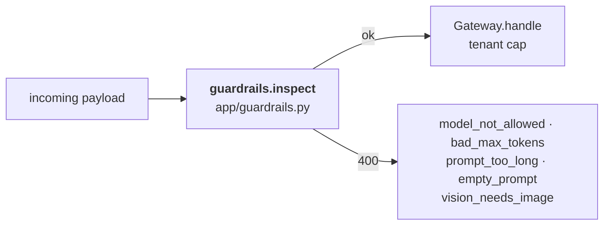

# Gateway — entry, guardrails and admission

Everything that happens to a request before the router sees it.

Part of the [cluster docs](README.md). Overview: [ARCHITECTURE.md](ARCHITECTURE.md) · Request path: [DATAFLOW.md](DATAFLOW.md)

---

## The guardrail path

New in 10, and it runs *before* admission:

Five rejections, all **400**, all before any routing happens. It also *mutates*
the payload: a missing `max_tokens` is defaulted to 512, anything above 512 is
clamped down, and `tenant` defaults to `lab`.

This matters because Open WebUI is a real client sending arbitrary requests —
guardrails are what stop a browser from asking for 100 000 tokens.

| Rejection | Cause |
|---|---|
| `model_not_allowed` | Model not in the local vLLM allowlist |
| `bad_max_tokens` | Non-integer or <= 0 |
| `prompt_too_long` | Over 8 000 characters |
| `empty_prompt` | Text model with no text |
| `vision_needs_image` | Vision model with no image part |
