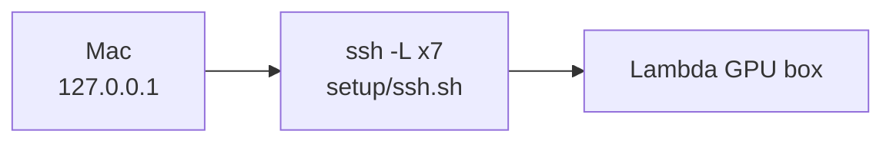
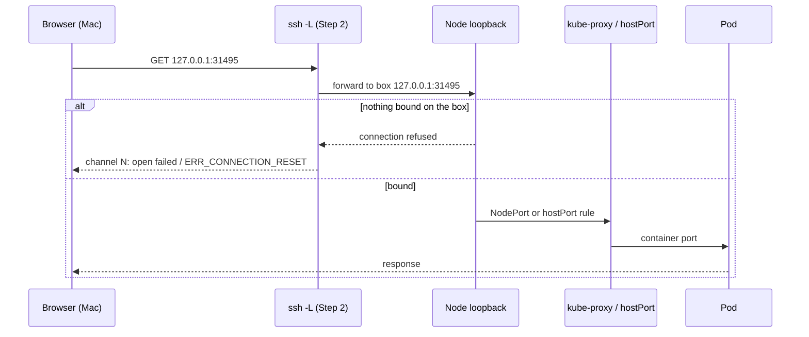
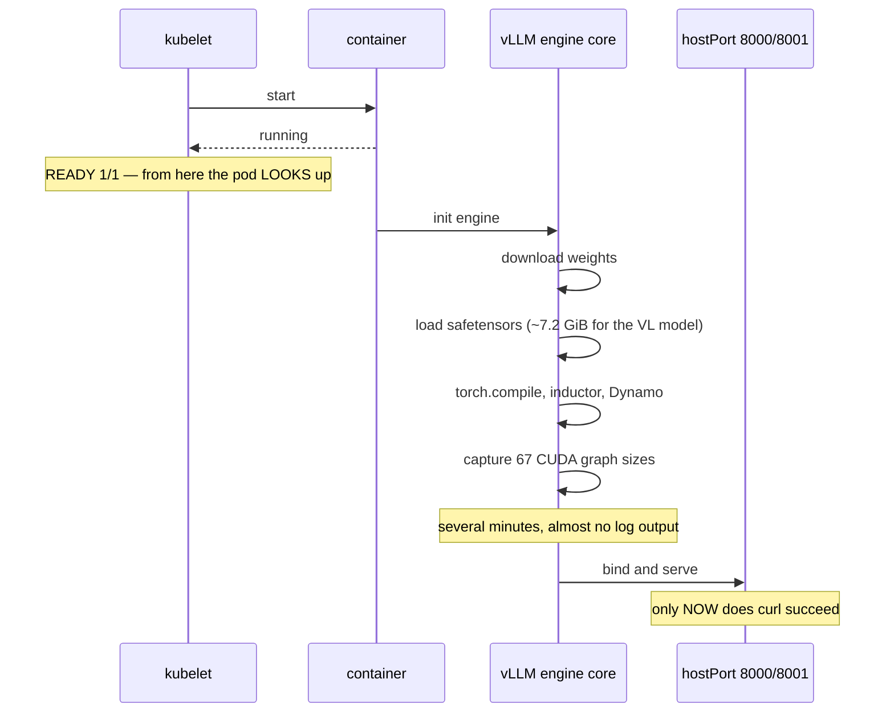
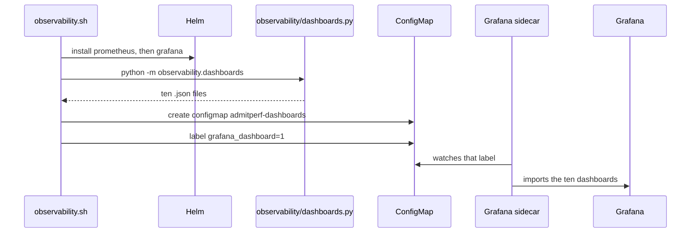
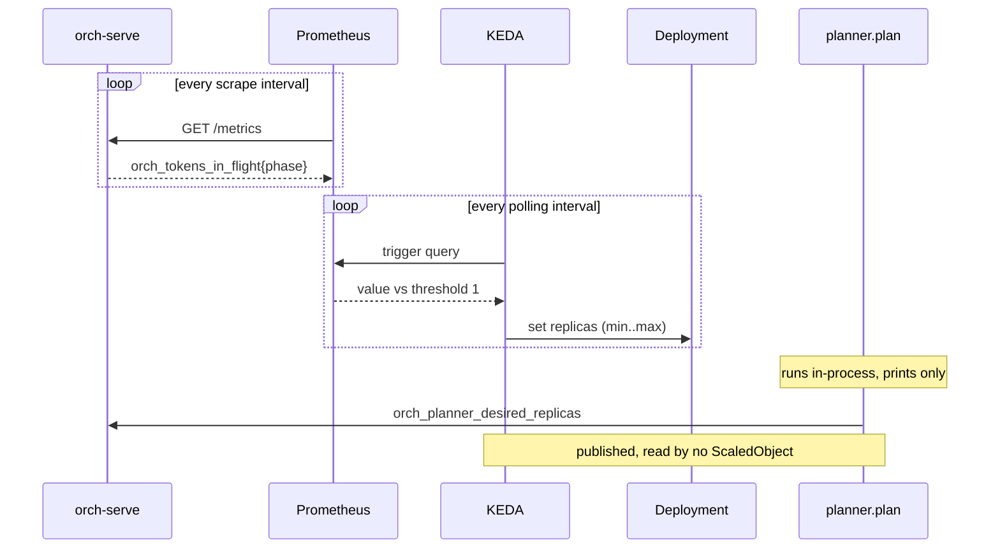

# Infrastructure — access, startup, HAMi and KEDA

How you reach the cluster, why pods look ready before they are, and what the two controllers do.

Part of the [cluster docs](README.md). Overview: [ARCHITECTURE.md](ARCHITECTURE.md) · Request path: [DATAFLOW.md](DATAFLOW.md)

---

## Access path — the SSH tunnel

Lambda's firewall allows only SSH, so nothing is reachable directly. One
`ssh -L` session carries everything:



| Local port | Reaches |
|---|---|
| 8000, 8001 | vLLM text and vision engines |
| 8080 | orch-serve gateway |
| 30080 | orch-serve NodePort |
| 50051 | Mooncake store |
| 30030 | Open WebUI |
| 31495 | Grafana |

## Reaching anything — the full hop chain

Every URL you open traverses five layers. Knowing the order is how you tell a
dead tunnel from a dead pod.



| Symptom | Layer that failed |
|---|---|
| `channel N: open failed` | Nothing listening on the box for that port |
| `ERR_CONNECTION_RESET` | Same — SSH accepts locally, then resets when the remote refuses |
| Shell works, one URL dead | That service only; the tunnel is fine |
| All URLs dead, shell alive | The forwards died — restart `setup/ssh.sh` |
| Works from the box, not the Mac | The forward, not the service |

**Ports are bound three different ways here**, which is why they fail
differently. vLLM and orch-serve use `hostPort` on the pod, so they bind as soon
as the *container* starts. Open WebUI, mooncake and the vLLM Services also have
pinned `nodePort`s. **Grafana's `nodePort` is not pinned** — `grafana-values.yaml`
sets `type: NodePort` with no port, so Kubernetes allocates randomly and it will
usually *not* match the `31495` that `ssh.sh` forwards. `kubectl port-forward`
sidesteps all of it by binding the box's loopback directly.

## Pod startup — why `READY 1/1` lies

There are **no readiness probes** on the vLLM pods. `1/1` flips when the
container process starts, which is minutes before vLLM serves anything.



Everything between `READY 1/1` and `bind` is dead time in which `smoke_sliced.sh`
fails and looks like a crash. Wait for the port, not the pod:

```
until curl -sf http://127.0.0.1:8001/v1/models >/dev/null 2>&1; do sleep 10; done
```

If the engine dies in that window, the API server prints an asyncio traceback
ending in "see root cause above" — the real error is on the `(EngineCore_DP0 …)`
lines before it. `kubectl logs … | grep -v '(APIServer'` is how you see it.

## Dashboards — generated, not written



The label is load-bearing: without `grafana_dashboard=1` the sidecar ignores the
ConfigMap and Grafana comes up empty. And because the JSON is **regenerated on
every run**, hand-edits to the files are overwritten — change `METRIC_NAMES` in
`dashboards.py` instead.

## The autoscale loop



Two independent loops on different intervals — which is why a burst shows in
Grafana well before replicas move. The planner is beside both, not inside
either.

**This is the single point of failure for the whole lab.** Every `127.0.0.1` URL
dies with that session, so a dashboard that stops loading usually means the
Step 2 terminal closed, not that the cluster broke. `ServerAliveInterval=30`
keeps it from idling out.
