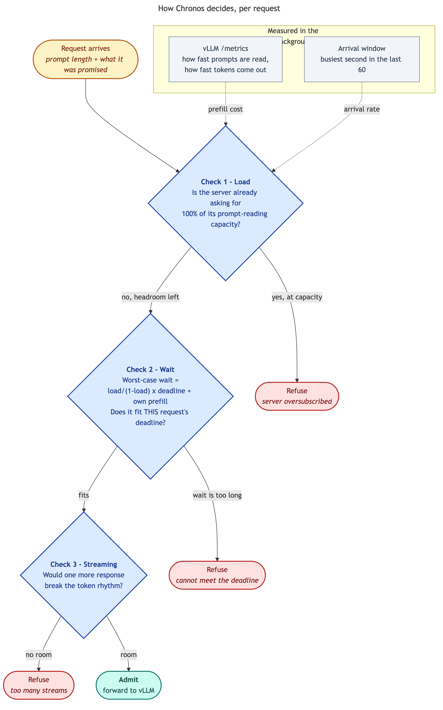
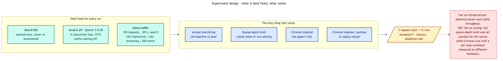

# Running Chronos on a Real GPU

**Harshul Jain, Tanmay Sah, Tanya Sah, Parv Khatri**
AdmitPerf technical report · 2026-09-15

---

## Summary

Chronos is a 2026 paper that borrows a forty-year-old idea from real-time
systems — *before you accept a job, check whether you can actually finish it on
time* — and applies it to LLM serving. It comes with proofs and a simulator.
What it does not come with is any test on a real serving engine; the authors
say so themselves and list it as future work.

We implemented their admission test, pointed it at a real vLLM server on a
rented GPU, and compared it against doing nothing.

Three things came out of it:

1. **The algorithm ports cleanly.** About 200 lines. No conceptual obstacles.
2. **It was far more cautious than the paper reports** — it accepted 23% of
   traffic where the paper accepts 54–89%. We traced why, and it is a problem
   with how we feed it numbers, not with the algorithm.
3. **At the load we tested, nothing performed well** — and our Chronos was
   beaten on its own terms by a four-line queue-depth rule, which says the
   configuration is wrong rather than the idea. So this is a working pipeline
   for reproducing the paper, not a verdict on whether Chronos is good.

---

## 1. What Chronos actually does

### 1.1 The core idea

Most admission control watches the system and reacts: latency is climbing, so
start refusing requests. Chronos does something different. For each arriving
request it asks a question that can be answered *before* accepting:

> Given everything already in flight and how fast traffic is arriving, is there
> any way this request finishes in time?

If the answer is no, it refuses immediately. Not because the server looks busy,
but because the request is provably doomed — and letting it in would also slow
down everything queued behind it.

This is how air-traffic control and engine-control software have worked for
decades. Chronos is the first work we know of to bring it to LLM serving.

### 1.2 How it models a request

An LLM request has two phases with very different behaviour, so Chronos treats
them separately:

- **Prefill** — reading the prompt. Happens once. Cost grows with prompt length.
- **Decode** — generating the answer, one token at a time. Every token must
  arrive promptly or the response looks choppy.

Prefill maps to a deadline: *first token within X milliseconds*. Decode maps to
a rhythm: *no gap between tokens longer than Y milliseconds*. Chronos gives a
rule for each.

### 1.3 The waiting-time rule

The paper's central result estimates the worst case wait as:

```
worst-case wait  =  (load / (1 - load)) × deadline  +  own prefill time
```

Read "load" as **what fraction of the GPU's prompt-reading capacity the
incoming traffic is asking for**. At 50% load the server is doing half the
prompt-reading work it is capable of.

The shape of that fraction is the whole story:

| Load | `load / (1 − load)` | Meaning |
|---|---|---|
| 25% | 0.33 | comfortable |
| 50% | 1.0 | at the edge |
| 75% | 3.0 | wait is triple the deadline |
| 90% | 9.0 | hopeless |
| 100% | ∞ | no promise possible |

This is a formal version of something every engineer has felt: a queue does not
degrade gently as it fills, it degrades *suddenly* near capacity.

**A consequence that surprised us.** The deadline appears on both sides — it is
inside the formula as well as being the thing you compare against. So asking
for a tighter deadline also shrinks the predicted wait, and the two largely
cancel. What actually decides the answer is the **load**, and the fraction only
stays under 1 while load is under 50%.

In other words: Chronos refuses almost everything once the server passes half
its prompt-reading capacity, no matter how generous the deadline. That is not a
quirk of our implementation — it explains the paper's own numbers, where
acceptance falls to 54% when load is pushed to ten times nominal.

### 1.4 The streaming-capacity rule

A second rule limits how many responses can stream at once. Each generation
step has a fixed overhead plus a per-response cost, so there is a hard ceiling
past which token gaps exceed the promised rhythm.

At the paper's numbers and a 200ms gap budget, our reading gives **772**
concurrent responses. The paper says about **731**. We record the difference
rather than fudge our numbers to match — their figure evidently includes a term
our reading of the published formula misses. It did not affect anything here,
because this rule never triggered in our tests.

### 1.5 The test itself

Three checks on every arrival, in order. The first two questions are about the
*server*; only the third is about the request in front of you:

<p align="center">
  
</p>


| Check | Refuses when | Plain meaning |
|---|---|---|
| 1. Load | load is at or above 100% | server is oversubscribed, no promise is possible to anyone |
| 2. Wait | predicted wait exceeds this request's deadline | *this* request cannot make it |
| 3. Streaming | one more response breaks the token rhythm | too many streams already |

Arrival rate is measured over a rolling 60-second window, using the **busiest
second** rather than the average — averaging a burst across a minute would hide
exactly the overload the test exists to catch.

### 1.6 What the paper reports

Replayed Azure production traces, 50,000 requests, a 7B model on an A100:

| Load | Approach | Missed deadlines | Accepted |
|---|---|---|---|
| 5× normal | **Chronos** | 0.00% | 88.9% |
| 5× normal | No admission control | 0.00% | 100% |
| 5× normal | Rate limiter, same volume | 6.80% | 88.9% |
| 10× normal | **Chronos** | 0.00% | 53.9% |
| 10× normal | No admission control | **99.44%** | 100% |

The third row is their sharpest point. A plain rate limiter, tuned to accept
*exactly as many requests as Chronos*, still misses 6.8% of deadlines where
Chronos misses none. **Which requests you accept matters, not just how many.**

---

## 2. Can it be reproduced?

### 2.1 What they released

A simulator, at `github.com/am-research/rtss-ttft-tbt`. Runs on a laptop in two
minutes, no GPU, fixed random seed, includes all the comparison approaches. By
the standards of this field that is unusually good — of 14 papers on admission
control in our survey, only two ship anything runnable.

> **A correction to our own notes.** Our `feasibility_audit.md` says Chronos has
> "no code (theory paper)." That is wrong — the simulator exists, and our own
> reading notes record it. The audit was written before anyone read the paper
> properly and never got updated. Now fixed.

### 2.2 The gap they left

Everything is simulated. The speed numbers for the GPU are calculated from
hardware specifications on paper, not measured from a running server. Their own
limitations section says real measurements could replace them but the released
code does not do that.

So the proofs are sound *about their model*. Whether the model matches a real
server is untested. **That gap is what this study is about** — not whether the
theorems are correct, they are theorems, but whether the test behaves usefully
when its inputs come from a real GPU instead of a spreadsheet.

### 2.3 What we could and could not carry over

| Piece | Status |
|---|---|
| How prefill cost is calculated | copied exactly |
| The waiting-time rule | copied exactly |
| The streaming-capacity rule | copied; ours says 772, paper says ~731 |
| The three checks, in order | copied exactly |
| 60-second arrival window | copied |
| GPU speed numbers | **changed** — measured from the live server instead of calculated |
| Fixed per-step overhead | **not measured** — kept the paper's A100 figure |
| Azure production traces | **not used** — we generated traffic instead |
| Their three other comparison approaches | **not implemented** — only the do-nothing baseline |

Two of those matter enough to say plainly:

**We could not measure the fixed overhead.** Every generation step has a fixed
cost plus a per-token cost. Telling them apart requires measuring at several
different batch sizes; the server only reports totals. So we kept the paper's
number — measured on an A100 running a 7B model — while running an A10G with a
0.5B model. It is almost certainly wrong for our hardware.

**We estimate load rather than knowing it.** The paper controls its own traffic,
so it knows the arrival rate exactly. We infer it by watching arrivals and
estimating prefill cost, so our load figure carries the error of both.

Because of those two, we call our implementation *Chronos-inspired*, never
Chronos. It runs their algorithm; it does not reproduce their guarantee.

---

## 3. What we compared, and why

This is the part worth being explicit about, since it decides what the numbers
can mean.

Every approach below ran against **the same GPU, the same server, the same
settings, and the same traffic**. We start the server once, then run each
approach against it in turn. Nothing is re-provisioned in between, so the only
thing that differs between rows is the accept/refuse decision. That is the
reason provisioning and benchmarking are separate commands in this tool.

| Approach | What it is | Why it is here |
|---|---|---|
| **Accept everything** | No admission control at all | The paper's own baseline. It is what vLLM does out of the box, and it is the thing any admission control has to beat. |
| **Queue-depth limit** | Refuse when more than 4 requests are already waiting | A deliberately simple contrast: refuse based on *how busy the server looks*, ignoring what each request needs. It answers "how much of the benefit comes from just refusing traffic at all?" |
| **Chronos-inspired** | The paper's test, parameters measured live | The thing under study. |
| **Chronos-inspired, cautious** | Same, with a 2× safety margin | Our numbers are estimated rather than derived, so we wanted to see what extra caution buys. |

<p align="center">
  
</p>

### Is this a fair comparison?

**Fair on everything infrastructural.** Same GPU, same model, same capacity
limit, same traffic, same seed, three repeats each. Nothing about the
environment favours one approach.

**Not fair on tuning, and this cuts against Chronos.** The queue-depth limit has
one knob, and we picked a sensible value for this server. Chronos has several
inputs, one of which — the fixed per-step overhead — we know is wrong for this
hardware (§2.3). A wrong overhead inflates the estimated cost of every request,
which inflates the estimated load, which makes the test refuse more. So Chronos
is running with a handicap we can name but have not yet removed.

**One comparison is missing, and it is the important one.** The paper's
strongest claim is against a *rate limiter tuned to accept the same number of
requests*. That isolates whether picking the right requests beats simply picking
fewer. We have not built it. Until we do, we cannot test the paper's central
argument — only observe that Chronos refuses a lot.

---

## 4. The traffic we generated

We did not replay a production trace. We generated traffic, and its shape
determines what the results can show, so here it is.

**Timing.** Requests arrive randomly, the way real traffic does — clustered
into bursts rather than evenly spaced. Over the 150-request run: average gap
47ms, and the variation in gaps is about the same size as the average, which is
the signature of genuinely random arrivals. Achieved rate 21 per second over
about 7 seconds. Bursts are the point; an approach that only ever sees smooth
traffic is never really tested.

**Three kinds of request**, with deliberately different promises, because if
every request wants the same thing then every approach looks identical. The
interesting question is *which* request an approach sacrifices.

| Kind | Share | First token within | Gap between tokens | Typical prompt |
|---|---|---|---|---|
| Interactive | 54% | 500ms | 50ms | 304 tokens |
| Streaming | 26% | 2,000ms | 100ms | 1,352 tokens |
| Batch | 20% | 30,000ms | — | 2,395 tokens |

**Size range.** Prompts from 79 to 4,042 tokens (median 431); answers from 34 to
2,041 tokens (median 244). Three tenants, roughly evenly split.

**Repeatable.** Fully determined by the seed. The generator uses its own private
random number source, so a policy or server that happens to call `random()`
cannot shift the traffic and make two runs incomparable.

**Where this differs from the paper, and it matters.** The paper gives every
request 2,000ms for the first token. Our interactive class demands 500ms — four
times tighter — on a smaller, slower setup. A good chunk of the gap in §5 may
simply be that we set a harder exam.

---

## 5. Results

### 5.1 The numbers

12 runs: 4 approaches × 3 repeats.

| Approach | Accepted | Slow-request latency (95th pct) | Useful work | Missed deadlines |
|---|---|---|---|---|
| Accept everything | 100% | 4,750ms ±853 | 0.113 | 84.4% |
| Queue-depth limit | 66% | 1,618ms ±219 | **0.180** | 59.3% |
| Chronos-inspired | 23% | 1,216ms ±494 | 0.080 | 64.5% |
| Chronos-inspired, cautious | 5% | **515ms ±162** | 0.027 | **36.8%** |

**How to read the columns.** The first three are the middle of the three runs,
with ± showing the spread actually observed — not a statistical confidence
interval. The last column is different: it **pools all three runs together**
rather than taking the middle one.

That inconsistency is deliberate, and worth explaining rather than hiding. The
deadline figure only counts *accepted* requests, so the tighter an approach is,
the fewer requests it has to be judged on. The cautious variant accepted 6, 7
and 6 requests across its three runs; a "middle run" out of samples that small
is noise, not a measurement. Pooling gives 19 requests instead of 6. For
comparison, here is what both look like:

| Approach | Per-run missed % | Middle run | **Pooled (used above)** |
|---|---|---|---|
| Accept everything | 84.7 · 92.5 · 76.1 | 84.7% | 84.4% (276/327) |
| Queue-depth limit | 61.8 · 60.3 · 55.9 | 60.3% | 59.3% (121/204) |
| Chronos-inspired | 30.4 · 85.3 · 66.7 | 66.7% | 64.5% (60/93) |
| Chronos-inspired, cautious | 0.0 · 71.4 · 33.3 | 33.3% | 36.8% (7/19) |

Neither choice changes the ordering, but note how wide the per-run values are —
Chronos ranges from 30% to 85% missed across three identical runs. **On these
sample sizes the deadline column should be read as a rough indication, not a
measurement.**

*"Slow-request latency" is the 95th percentile time to first token — only 1 in
20 requests waited longer. "Useful work" counts requests that both completed
and met their deadline, divided by everything offered, so an approach cannot
score well by refusing nearly everything.*

Why each approach refused:

```
Chronos-inspired             150 × "can't meet the deadline",  204 × "server oversubscribed"
Chronos-inspired, cautious   245 × "can't meet the deadline",  183 × "server oversubscribed"
Queue-depth limit            156 × "too many already waiting"
```

### 5.2 What it means

**The basic mechanism works.** Latency falls steadily as acceptance tightens:
4,750 → 1,618 → 1,216 → 515ms. Deadline misses fall the same way, 84% → 37%.
Refusing traffic does protect the traffic you keep. That is the thing admission
control is supposed to do, and it did it.

**But nothing here is good.** The best result still misses 37% of deadlines, and
only by accepting 5% of traffic. The paper reports missing *zero* while
accepting 54%. We are reproducing the paper's *shape*, not its results.

**The simple approach wins on useful work, and it wins twice over.** The
queue-depth limit scores 0.180 against Chronos's 0.080 — and it is not merely
that Chronos accepts fewer requests. Of the requests each one *did* accept,
queue-depth met 40.7% of deadlines against Chronos's 35.5%. Chronos accepted a
third as much traffic and still served it slightly worse.

That is the clearest evidence our Chronos setup is **mistuned rather than
merely strict**. A correctly-tuned feasibility test should be *more* accurate
per request than a threshold that ignores what each request asked for; that is
the entire premise. Ours is not, which points at the inputs rather than the
algorithm (§5.3).

The cautious variant is the exception that supports this reading: it met 63.2%
of deadlines among accepted requests — genuinely better per-request than
anything else here — but accepted so little that it still scores worst on
useful work. The mechanism can pick good requests; our default configuration is
not picking them.

**The most telling detail:** more of Chronos's refusals were *"server
oversubscribed"* (204) than *"this request can't make it"* (150). Check 1 is
firing before check 2 is even consulted. That means our implementation is
mostly behaving like a **blunt rate limiter** — which is precisely the thing the
paper designed its experiments to argue *against*.

### 5.3 Why the load estimate maxes out

Load is arrival rate multiplied by prefill cost. With arrivals measured at the
busiest second (~21/s) and prefill cost estimated around 48ms, load lands right
at 100% — the boundary where the test refuses everyone. Two causes compound:

1. **Measuring the busiest second against bursty traffic.** Random arrivals
   produce short bursts well above the average rate. Taking the peak is faithful
   to the algorithm and right in principle, but with a one-second window it
   reports a momentary burst as if it were sustained.
2. **The prefill cost is calibrated for the wrong hardware.** We kept the
   paper's fixed per-step overhead, measured on an A100 running a 7B model, and
   applied it to an A10G running a 0.5B model. For a model this small that fixed
   term is a large share of the total, so the estimate is likely well off.

The streaming-capacity check never triggered, which is consistent with §1.4's
note that the 772-vs-731 discrepancy did not affect anything.

### 5.4 What could be wrong with all of this

- **One GPU, one model, 150 requests, three repeats.** Nothing generalises.
- **Our deadlines are four times tighter than the paper's** on slower hardware.
  That alone could explain much of the gap.
- **The unmeasured overhead biases against Chronos** in a way we can name but
  have not corrected.
- **Three of the paper's four comparison approaches are missing**, including the
  one that tests its main claim.
- **The "useful work" score is squeezed** because at this load most requests
  miss the interactive deadline no matter what, which compresses the differences
  between approaches.

---

## 6. Conclusions

**On porting it.** The algorithm moves to a real server without difficulty —
about 200 lines of arithmetic reading the server's own metrics. The whole
pipeline, from renting a GPU to a comparison table, runs end to end for roughly
40 cents.

**On reproducing it.** We did not, and do not claim to. The obstacle is not the
algorithm but *feeding it correct numbers*. Load is the single input everything
pivots on, and estimating it from a live server turns out to be a harder problem
than a paper that controls its own traffic ever has to face. That is a real
finding about deploying this kind of admission control, and it is invisible in
simulation.

**What this establishes.** A working reproduction pipeline, not a verdict. Every
number traces back to a saved run; every run records the exact settings that
produced it.

### What to do next, most valuable first

1. **Measure the fixed per-step overhead** by testing at several batch sizes.
   Until then the cost estimate is wrong and every Chronos result is biased
   toward refusing.
2. **Build the rate limiter comparison** — same number of requests accepted, but
   chosen blindly. It is the paper's sharpest claim and the cheapest to test.
3. **Use the paper's settings**: 2,000ms for every request, so we are answering
   the same exam.
4. **Replay the Azure traces** instead of generated traffic, removing one more
   difference.
5. **Run our implementation against their simulator** at identical settings. If
   they disagree there, our port is wrong. If they agree, the difference is the
   real hardware — which is the interesting answer.

---

## Sources

Marref, A., Tarmissi, K., & Chaibi, H. (2026). Formal schedulability analysis
for LLM inference: TTFT and TBT deadline guarantees via response-time theory.
*Frontiers in Computer Science*, 8.
[doi.org/10.3389/fcomp.2026.1873627](https://doi.org/10.3389/fcomp.2026.1873627).
Their code: `github.com/am-research/rtss-ttft-tbt`.

Figures: `figures/*.mmd` are the source; `make diagrams` re-renders them.

Our reading notes: `../../survey/notes/chronos.md`.
Our implementation: `../policies/admitperf_zoo/chronos/`.
Saved runs: `results/chronos/`.
